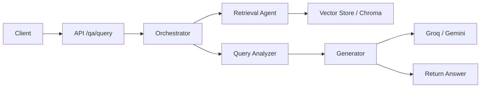

LangGraph Flow (high level)

This document describes the multi-agent flow implemented in the project and where to find components.

Mermaid diagram

Files and responsibilities
- `app/agents/orchestrator.py`: wires agents (LangGraph) and coordinates the flow.
- `app/agents/query_analyzer.py`: parses and reformulates user queries.
- `app/agents/retrieval.py`: performs hybrid (vector + keyword) search via `app/core/vector_store.py`.
- `app/agents/generator.py`: calls Groq (primary) and Gemini/other fallbacks for final answer generation.
- `app/agents/document_processor.py`: handles upload text extraction, PDF/OCR and chunking.
- `app/core/embeddings.py`: embeddings client with retry + deterministic fallback.
- `app/core/vector_store.py`: vector add/query and metadata handling.

Operational notes
- Ensure `GROQ_API_KEY` and `GEMINI_API_KEY` are populated and have model access for full functionality.
- The system falls back gracefully when external models are unavailable (see `app/agents/generator.py`).
- To debug end-to-end, start MCP servers (if used), then backend and follow logs in the console.
